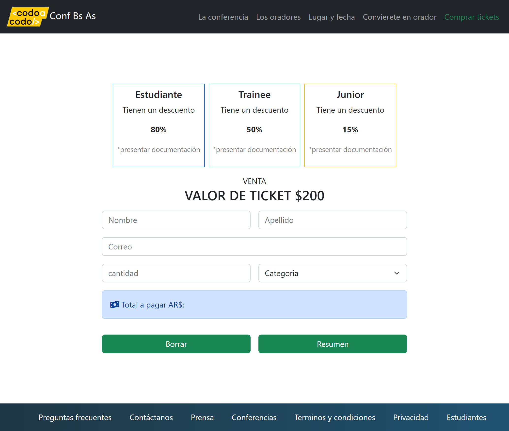

<!-- Please update value in the {}  -->

<h1 align="center">Conf. BS AS</h1>

   Solución del Trabajo práctico integrador 1</a>.

  <h3>
    <a href="./img/final_front_2022.jpg" id="demo" width="100%">
      Demo 1
    </a>
    <a href="./img/demo.png" id="demo" width="100%">
      Demo 2
    </a>
     | 
    <a href="https://astounding-peony-66b5d4.netlify.app/">
      Solución
    </a>
  </h3>

<!-- TABLE OF CONTENTS -->

## Contenido

- [General](#general)
  - [Estructurado con](#Estructurado-con)
- [Características](#Características)
- [Mis redes y recursos](#Mis-redes-y-recursos)

<!-- OVERVIEW -->

## General

### Estructurado con
En este trabajo practico, hice uso de los lenguajes HTML y CSS, Framework Bootstrap y Javascript

- [HTML]()
- [CSS]()
- [BOOTSTRAP](https://getbootstrap.com/)
- [Javascript]()

## Características

Esta página ha sido creada en dos partes:

1. Para completar el 1er desafío práctico del curso JS-FRONT END 2022 2 [Trabajo práctico](https://aulasvirtuales.bue.edu.ar/mod/journal/view.php?id=305793) para el cual se debía replicar [esta página](./img/final_front_2022.jpg) con lo visto en clase hasta el momento, se recomiendó el uso de bootstrap.
2. El 2do desafío, que consitía en replicar [la página de venta de boletos](./img/demo.png), agregando la funcionalidad al botón de "resumen", para que muestre en pantalla el total de la cuneta según la categoría y la cantidad de entradas
* No es responsive
* Está estructurada, en su mayoria con bootstrap
* algunos enlances y el formularios son estéticos
* Maneje la paleta de colores de bootstrap, sin alterar la base

## Mis redes y recursos

- GitHub [Katherin Guerrero](https://github.com/Sarkastherin)
- Twitter [@sarkastherin](https://twitter.com/SarKastherin)
